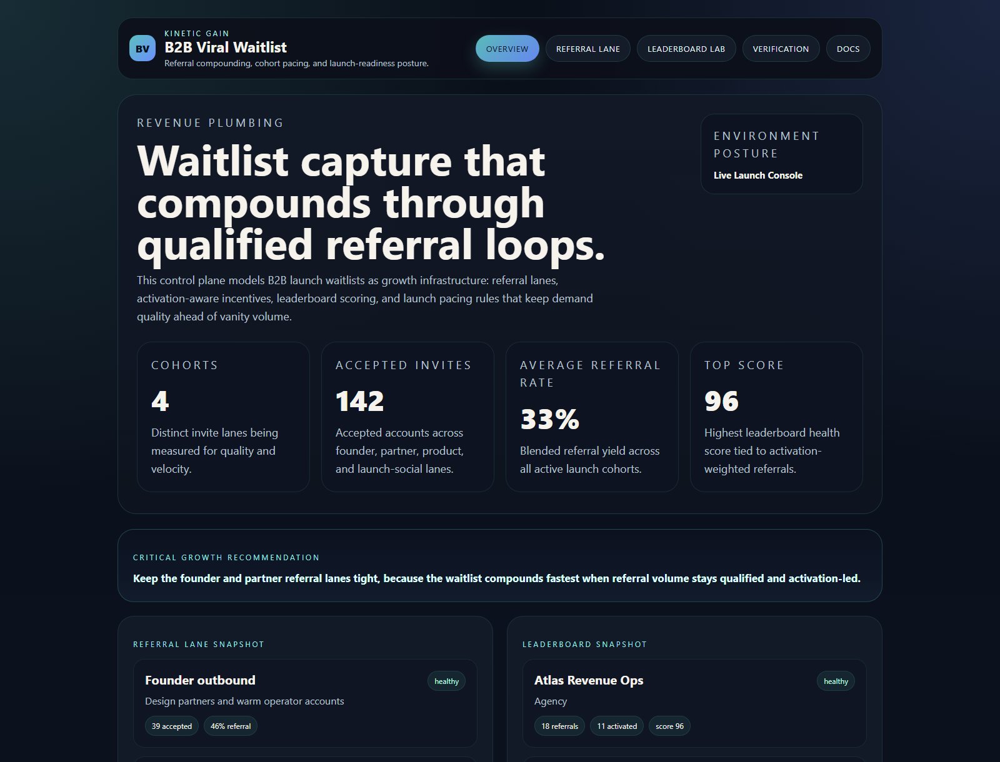
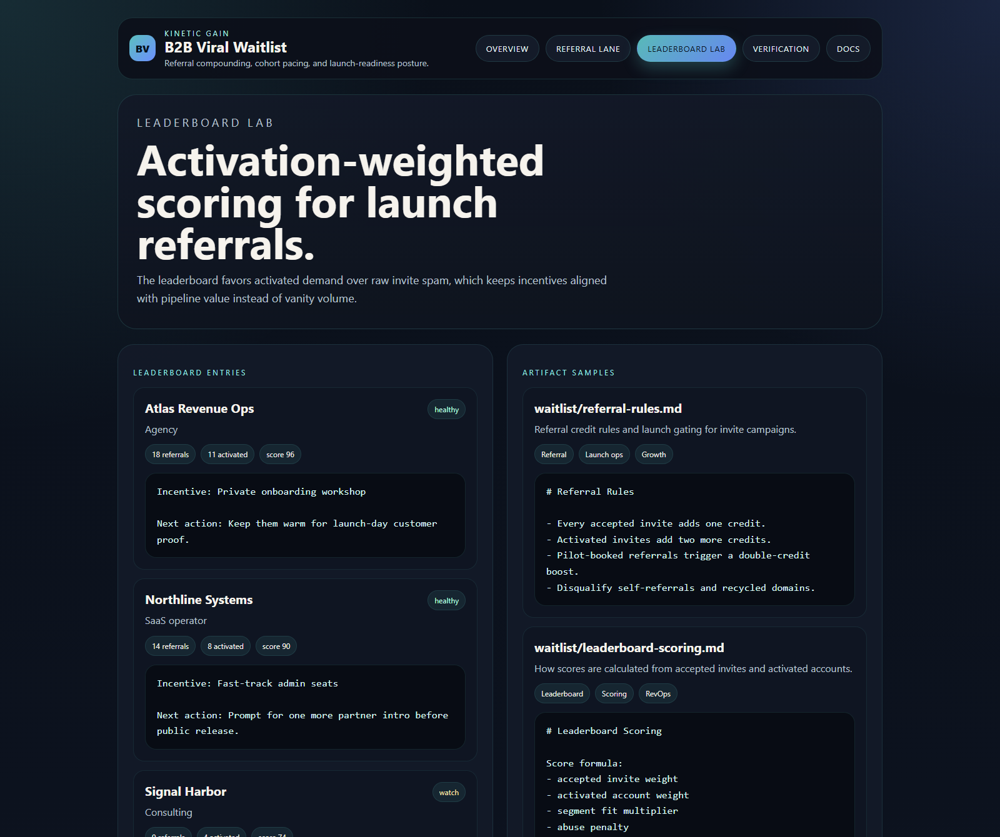

# b2b-viral-waitlist

Board-ready Kinetic Gain surface for referral-driven B2B waitlists, cohort pacing, activation-aware scoring, and launch gating rules that keep growth quality ahead of vanity volume.

- Live: [http://waitlist.kineticgain.com/](http://waitlist.kineticgain.com/)
- Repo: [https://github.com/mizcausevic-dev/b2b-viral-waitlist](https://github.com/mizcausevic-dev/b2b-viral-waitlist)

## Why this matters

Leaders need one waitlist surface that shows which referral lanes are compounding qualified demand, which incentives are distorting launch quality, and where activation pressure should move before the next go-to-market push.

## Product depth

B2B Viral Waitlist turns launch interest, referral channels, accepted invites, activation quality, and incentive rules into one governed launch surface. It connects cohort source, audience, invite volume, accepted accounts, referral rate, boost logic, leaderboard posture, and launch-readiness checks in one operating view.

For a SaaS go-to-market analyst, the product answers which waitlist lanes create qualified demand, which channels only create vanity volume, and where product marketing, sales, partnerships, or community teams should intervene before launch capacity gets wasted.

For a SaaS value architect, it exposes where launch value leaks: weak cohort quality, over-weighted incentives, leaderboard gaming, referrals that do not activate, and launch motions that overwhelm onboarding or sales without producing buyer-ready accounts.

For technical reviewers, the repo includes static routes, API-style outputs, seeded cohort data, leaderboard scoring, artifact samples, verification checks, prerendered pages, smoke tests, and screenshot generation. It is meant to demonstrate an inspectable operator surface, not a keyword-only landing page.

## What these repos have in common

This follows the broader Kinetic Gain pattern: every surface keeps owner, signal, model, risk, value, route, and verification visible together so non-technical and technical readers can understand what the system does and why it matters.

## Operating workflow

1. Ingest waitlist cohorts, invite counts, accepted accounts, referral rates, activation posture, and incentive rules.
2. Score each lane for qualified demand, vanity-volume risk, referral compounding, and onboarding pressure.
3. Surface launch gates that tell GTM, product marketing, sales, and partnerships where to intervene.
4. Publish a proof page plus JSON outputs so growth quality, launch readiness, and referral integrity are reviewable without private systems.

## What it includes

- TypeScript control plane for referral-driven B2B waitlists, leaderboard scoring, invite cohorts, and activation-aware growth loops
- synthetic launch cohorts across founder, partner, product-led, and social invite lanes
- reusable outputs for referral pacing, leaderboard posture, launch artifacts, and board-facing growth narratives
- prerendered static site, JSON payloads, screenshots, and docs

## Routes

- `/`
- `/referral-lane`
- `/leaderboard-lab`
- `/verification`
- `/docs`

## Local run

```powershell
cd b2b-viral-waitlist
npm install
npm run verify
npm run prerender
npm run render:assets
```

## CLI

```powershell
npm run demo
npm run smoke
```

## Docs

- [docs/architecture.md](./docs/architecture.md)
- [docs/incentive-notes.md](./docs/incentive-notes.md)
- [docs/ORIGIN.md](./docs/ORIGIN.md)

## Screenshots




